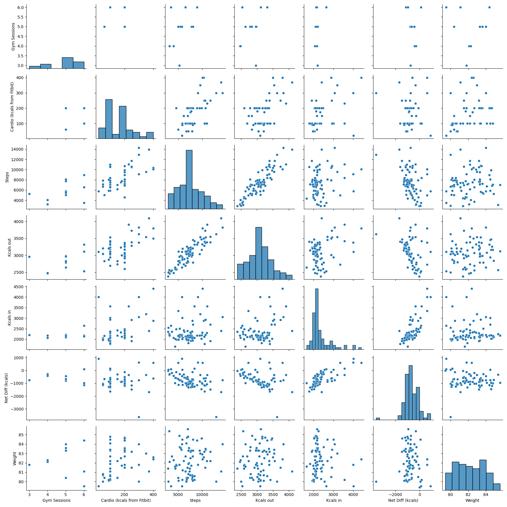
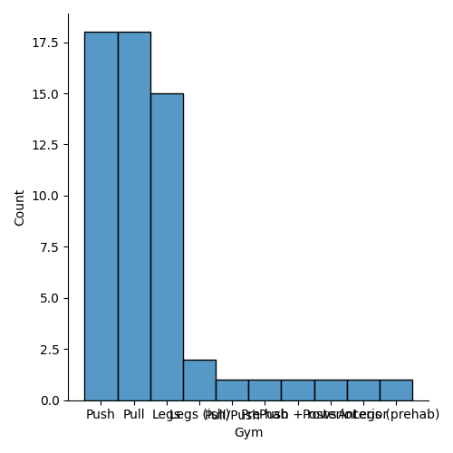

# TL;DR
In this analysis of a 12-week weight management journey documented through MyFitnessPal and Apple Numbers, we employed Exploratory Data Analysis (EDA) techniques to dissect daily and weekly data sets on calorie intake, expenditure, and physical activity.

The study reveals a strong positive correlation (r=0.89) between steps taken and calories expended daily, underscoring the significant impact of walking on calorie burn. Weekly analysis echoed this pattern, showing a consistent relationship between physical activity levels and caloric output. Additionally, a notable finding was the strong correlation between daily calorie intake and net caloric difference (r=0.77), suggesting that higher food consumption did not deter a caloric deficit, likely due to an increase in non-exercise activity thermogenesis (NEAT). However, gym sessions showed only a weak to moderate correlation (r=0.36) with both calorie expenditure and intake, hinting at their lesser role in overall weight management compared to daily walking. 


The analysis, enriched with visual aids like heatmaps and scatter plots, not only offers insights into effective weight management strategies but also enhances my coding and data science skills. This journey through data underscores the pivotal role of consistent, moderate activity—like walking—in achieving a caloric deficit and managing weight effectively.

# Quickstart
Run eda.py in python3 to give the below main menu:
``` Please enter: 
1  - Understand Data
2a - Clean (daily)
2b - Clean Data (weekly)
3  - Relationship Analysis - Heatmap
4  - Relationship Analysis - Pairplot
5  - Relationship Analysis - Scatterplot
6  - Relationship Analysis - Histogram
7  - Relationship Analysis - Catplot
r  - Reset data
q  - Quit
```
From this menu, to get the Heatmap for daily enter 2a to remove all non-daily columns, after which any of 3 -> 7 may be performed by entering the number when prompted. It does not matter in which order these are run as they do not interfere with one another.

To then run weekly analysis, enter r to reset the columns, then 2b for the weekly data. 

The resultant from each step is output into there associated folders, e.g. Daily/Heatmap (which are created if they do not already exist).

# Introduction

Before embarking on the challenging journey of fatherhood, I set about on a 12-week endeavor to manage my weight, fully aware that such personal goals might take a backseat amidst the new responsibilities. To navigate this journey effectively, I meticulously documented every aspect of my weight management routine using MyFitnessPal and Apple Numbers. This documentation covered a comprehensive array of metrics, including daily calorie intake, calories expended, and physical activity levels. 

The primary aim of this self-imposed challenge was not just to achieve a personal goal but to forge a path that could serve as a blueprint for future endeavors. The meticulous documentation was intended to serve a dual purpose: first, as a means to closely monitor and adjust my efforts in real-time, and second, as a valuable dataset for post-journey analysis. With the data now in hand, the task ahead involves a thorough exploration to discern the patterns, behaviors, and strategies that were most effective, as well as those that were less so.

In undertaking this analysis, the focus is not merely on the quantitative outcomes but also on the insights that can be gleaned to inform future weight management strategies. This involves an in-depth exploration of the relationship between various factors such as calorie intake, physical activity, and their cumulative effect on weight management over the course of the 12 weeks. By leveraging Exploratory Data Analysis (EDA) techniques, the goal is to unravel the complex interplay between these variables and to identify actionable insights that can guide future efforts.

This journey is as much about learning from the past as it is about paving the way for future endeavors. It is an exercise in self-reflection, data analysis, and strategy formulation, all aimed at achieving a healthier, more balanced lifestyle. As we delve into the data, we embark on a journey of discovery, seeking to understand the nuances of weight management and to equip ourselves with the knowledge and tools necessary for sustained success.


# Methodology

The methodology for this exploratory data analysis (EDA) is designed to uncover patterns, correlations, and insights from the dataset in a structured manner. The analysis is performed using Python, leveraging popular libraries such as Pandas for data manipulation, and Seaborn along with Matplotlib for data visualization. The script `eda.py` outlines a comprehensive approach to explore the dataset through various analytical tools and visualization techniques. Here's a detailed breakdown of the methodology:

## 1. Data Preparation
- **Loading Data**: The dataset is loaded into a Pandas DataFrame from a CSV file, ensuring that the analysis starts with the raw, unmodified data.
- **Data Cleaning**: The script offers options for cleaning the data based on its temporal resolution (daily or weekly). This step is crucial for preparing the data for accurate analysis by removing inconsistencies, handling missing values, and ensuring the data quality.

## 2. Exploratory Data Analysis
The EDA process is broken down into several steps, each focusing on different aspects of the data:

### a. Understanding the Data
- The initial step involves getting familiar with the basic structure of the dataset, including observing the first few and last few rows to understand the data's layout and content.

### b. Cleaning the Data
- Depending on the user's input, the data is cleaned considering its nature (daily or weekly), making it ready for further analysis.

### c. Relationship Analysis
The script facilitates relationship analysis through various visualization techniques, each offering unique insights into the data:

- **Heatmap**: Used to visualize the correlation between different variables in the dataset, highlighting strong and weak relationships through color coding.
- **Pair Plot**: Provides pairwise scatter plots for all variables, offering a comprehensive view of their interactions and distributions.
- **Scatter Plot**: Focuses on the relationship between two variables by plotting their values against each other, allowing the identification of patterns or trends.
- **Histogram**: Visualizes the distribution of a single variable, showing the frequency of data points within specific ranges.
- **Cat Plot**: Categorizes data points based on a categorical variable and shows their distribution, using box plots or similar visualizations.

## 3. Data Visualization Output
- The script is designed to save each visualization as a PNG file within a structured directory hierarchy, organized by the type of analysis (e.g., Heatmap, Pairplot) and the temporal resolution of the data (daily or weekly). This organization aids in the systematic review of the generated visualizations and supports a comprehensive analysis.

## 4. User Interaction
- The script employs a simple command-line interface allowing users to select the desired analysis step by entering specific commands. This interactive approach ensures flexibility in the analysis process, catering to different analytical needs and preferences.

# Data Analysis
## Heatmap Analysis

### Daily Trends


#### Exploratory Analysis
The heatmap for daily trends reveals several correlations between variables related to dietary intake, physical activity, and weight. A positive correlation between steps and calories expended suggests that increased physical activity is a significant contributor to calorie expenditure. Interestingly, there is a negative correlation with net calorie difference, which could indicate that on days with more steps, there may be a tendency to consume more calories, potentially reducing the caloric deficit.

##### Positive Correlations
The data suggests that the primary method of increasing caloric expenditure is through increased step count rather than through structured gym sessions or cardio workouts. This aligns with previous findings that NEAT plays a significant role in daily energy expenditure. For gym sessions, the correlation with weekly data may provide additional insights into the role of structured exercise in caloric balance.

##### Moderate to Weak Correlations
Calories from cardio activities show a moderate correlation with both step count and calories out, suggesting that cardio exercise contributes to overall activity levels. However, the weaker correlation between cardio and caloric intake may indicate a more complex relationship influenced by individual behaviors and choices.

##### Negative Correlations
The negative correlation between net calorie difference and both steps and calories out underscores the complex interplay between dietary intake and physical activity. While increased steps are associated with higher caloric expenditure, they also seem to influence caloric intake, potentially offsetting some of the caloric deficit achieved through activity.

#### Weight Correlations
Analysis of variables affecting weight shows that cardio activity has a positive correlation, suggesting its potential role in weight management. Conversely, gym sessions and caloric intake show a slight negative correlation with weight, which could reflect the multifaceted nature of weight loss where diet and exercise habits must be considered together.

### Weekly Trends


#### Exploratory Analysis
The weekly heatmap provides a broader view, smoothing out the daily variations to uncover longer-term trends. The strong correlation between mean and median weight confirms the reliability of these measures over an extended period.

##### Positive Correlations
Weekly data suggests a consistent relationship between calorie intake and the mean difference of calories, reinforcing the daily findings. Additionally, the correlation between weekly cardio and steps indicates a sustained pattern of activity contributing to caloric expenditure.

##### Negative Correlations
The negative correlation between weekly steps and mean calorie difference highlights the impact of increased activity on the caloric deficit, which may be more pronounced on a weekly basis due to cumulative effects.

#### Weight Correlations
The analysis of weight correlations on a weekly basis does not show strong connections with other variables, which may indicate that weight change is not directly proportional to weekly fluctuations in activity or diet. Instead, it suggests that consistent behavior over time, rather than short-term changes, is key to understanding weight trends.

Overall, both daily and weekly heatmaps offer valuable insights into the relationships between diet, exercise, and weight. While daily data captures immediate effects, weekly trends provide a clearer picture of long-term habits and their impact on health outcomes.

## Pair Plot
### Daily Trends


#### Observations

- **Gym Sessions and Cardio Calories from Fitbit**: There seems to be little to no correlation between the number of gym sessions and the calories burned during cardio as reported by a Fitbit device. The gym sessions histogram indicates that the data is skewed towards fewer sessions, suggesting that most participants do not frequent the gym often.

- **Steps**: The distribution of steps taken is somewhat positively skewed, indicating that while most participants fall within a moderate range of steps, there are a few with very high step counts. There does not appear to be a strong linear relationship between steps and any other variables.

- **Kcal vs. Cardio Calories and Steps**: The distribution of Kcal intake is roughly normal but shows some outliers or extreme values. The scatterplots do not suggest a clear correlation between Kcal intake and the calories burned during cardio or the number of steps taken.

- **Weight**: Weight distribution appears to be slightly positively skewed, with a concentration of values in the middle of the range. There’s a potential positive correlation between weight and net Kcal, which would be biologically plausible as higher net calorie intake might be associated with higher body weight.

- **Net Kcal (Kcals)**: The histogram of net Kcal shows a normal distribution with a slight negative skew. The negative values in net Kcal suggest that some individuals are in a calorie deficit. There is a visible positive correlation with weight, which is to be expected as typically a sustained calorie surplus would result in weight gain.

#### Concerns

- The presence of outliers, especially in the Kcal intake and net Kcal variables, could affect the correlations. It would be prudent to investigate these outliers to ensure they are not data entry errors.

- The variables 'Cardio Calories from Fitbit' and 'Steps' have some data points that seem to lie on a straight line at certain intervals, which may indicate measurement or data entry artifacts that could warrant further investigation.

#### Recommendations for Further Analysis

- **Correlation Coefficients**: Calculate Pearson or Spearman correlation coefficients to quantify the strength and direction of the relationships between variables.

- **Regression Analysis**: For variables that show potential correlations, perform regression analysis to understand the nature of their relationships better.

- **Outlier Analysis**: Conduct an outlier analysis to identify and potentially remove or adjust for extreme values that could be influencing the results.

- **Time Series Analysis**: If this data is time-series (daily data), analyzing it for trends, seasonality, or cycles could provide additional insights.

- **Cluster Analysis**: To identify distinct patterns or groups within the data, a cluster analysis might be useful, especially if there are subgroups within the population that behave differently.

- **Data Transformation**: For skewed distributions, consider transforming the data (e.g., log transformation) to meet the assumptions of parametric tests if they will be applied.

Overall, while some expected biological patterns are observed, such as the relationship between net calorie intake and weight, other variables do not show strong linear relationships. Caution should be used when interpreting these plots due to potential outliers and artifacts.

### Weekly Trends


This weekly pair plot extends the previous analysis of daily data to a weekly timeframe, providing insights into longer-term trends and patterns.

#### Observations

- **Weekly Cardio (kcal)**: The histogram for weekly cardio calories burned is positively skewed, indicating that most participants burn fewer calories per week, with a few outliers burning significantly more. This weekly pattern is consistent with the daily data, which also showed a positive skew.

- **Weekly Steps**: Similar to the daily data, the weekly steps histogram is positively skewed. The scatterplots do not suggest a strong linear relationship between weekly steps and other variables, just like in the daily data.

- **Weekly Average (kcal)**: The weekly average kcal intake shows a distribution that is less normal compared to the daily data, with a noticeable positive skew. This could suggest variability in eating habits on a weekly basis or reporting inconsistencies.

- **Weekly Kcal Difference**: There's a noticeable range of differences in weekly kcal intake, with a histogram that is fairly symmetrical around zero, indicating that over a week, participants are as likely to be in a caloric surplus as they are to be in a deficit. This differs from the daily data, which showed a slight negative skew, suggesting more frequent daily deficits.

- **Mean vs. Median Weight**: Both mean and median weight distributions are slightly positively skewed, similar to the daily weight observations. However, the weekly mean weight suggests a greater variance compared to the median weight, which could indicate the presence of outliers affecting the mean more than the median.

#### Comparisons to Daily Data

- The weekly data trends appear to follow the daily data trends closely, with similar distributions and patterns. This consistency suggests that the daily habits of individuals are aggregating into similar weekly patterns.

- Weekly caloric difference being symmetrical suggests that day-to-day fluctuations in calorie intake and expenditure might balance out over the course of the week.

- The absence of a strong linear relationship in the weekly data between variables such as steps and kcal intake is also observed in the daily data, suggesting that participants’ physical activity levels may not be closely linked to their caloric intake on both a daily and weekly basis.

#### Recommendations for Further Analysis

- **Compare Averages**: Conduct analysis comparing daily averages to weekly totals to understand how daily habits accumulate over the week.

- **Longitudinal Analysis**: Perform a longitudinal analysis to see if there are consistent weekly patterns over time.

- **Test for Differences**: Use statistical tests such as t-tests or ANOVAs to determine if there are significant differences between daily and weekly values.

- **Correlation Analysis**: Calculate correlation coefficients for weekly data to confirm the lack of strong relationships seen in the scatterplots.

- **Regression Models**: Develop regression models to predict weekly outcomes based on daily habits.

- **Time Series Decomposition**: If this data spans a long time period, decompose the time series to identify and understand seasonal effects or long-term trends.

In summary, the weekly data provides a broader view of participants’ behaviors, showing trends consistent with the daily data. It underscores the absence of strong relationships between activity levels and caloric intake/output, as well as the presence of outliers and variability in weekly patterns.

## Scatter Plot
### Daily Trends

In analyzing the scatterplots, certain plots were more indicative of potential correlations, especially when considering the hue variable, which adds a dimension of categorization to the analysis. Below are the key findings from the plots that warranted further inspection.

#### Noteworthy Scatterplots:

- **Weight vs. Kcals in/out (Hue: Gym Sessions)**: These plots showed a clustering of data points that varied with the number of gym sessions. This suggests that gym activity may interact with the relationship between caloric intake/outtake and weight, potentially highlighting the role of exercise in weight management.

- **Kcals out vs. Cardio (kcals from Fitbit) (Hue: Net Diff (kcals))**: There was a visible trend where individuals with higher net calorie deficits tended to have higher calories burned according to Fitbit data. This could indicate an effective tracking of increased physical activity leading to larger calorie deficits.

- **Steps vs. Cardio (kcals from Fitbit) (Hue: Kcals in)**: The plot indicated a moderate correlation between steps and calories burned during cardio, differentiated by daily calorie intake. It suggests that those with higher caloric intake might also be more active, which could be related to higher energy availability.

#### Omitted Scatterplots and Reasons:

- **Scatterplots with no discernible patterns**: Some plots showed a random dispersion of points without any apparent correlation or interaction effect with the hue variable. These plots were omitted from detailed analysis as they are less likely to yield actionable insights without further statistical testing.

- **Scatterplots with sparse data**: In cases where the data points were too sparse, it was challenging to draw any conclusions about correlations or the effect of the hue variable. These were also omitted as they do not provide a reliable basis for analysis.

- **Overplotted Scatterplots**: Some scatterplots had significant overplotting, making it difficult to visually assess the distribution of data points and any potential correlation. These require further analysis with techniques such as transparency adjustment, jittering, or alternative visualization methods to properly interpret the data.

#### Recommendations for Further Investigation:

- **Statistical Testing**: For scatterplots indicating potential correlations, it is advisable to conduct statistical tests, such as Pearson or Spearman correlation coefficients, to quantify the strength and direction of the relationships.

- **Regression Analysis**: Including the hue variable as a factor in regression models could provide insights into how it moderates the relationships between the primary variables.

- **Subgroup Analysis**: For variables where the hue indicated meaningful differences, subgroup analysis could further explore the characteristics and behaviors of these distinct groups.

The scatterplots suggest interesting relationships between daily activities, caloric balance, and weight, especially when considering additional factors such as gym sessions. However, these visual analyses should be augmented with rigorous statistical methods to confirm the findings and understand the underlying dynamics.

### Weekly Trends
The scatterplot analysis for weekly data reflects the aggregation of daily activities into longer-term patterns. The following are key observations from the plots that showed potential correlations or were particularly influenced by the hue variable.

#### Noteworthy Scatterplots:

- **Weekly Cardio (kcals) vs. Weekly Steps (Hue: Weight)**: There was a more pronounced correlation in the weekly data for cardio activity and steps compared to the daily data. The inclusion of weight as a hue variable revealed a stratification where individuals with higher body weight had a different pattern of activity, suggesting a relationship between weight and exercise habits.

- **Mean Weight vs. Weekly Average (kcals) (Hue: Net Diff (kcals))**: This plot showed a clearer trend on a weekly scale, with mean weight appearing to correlate with weekly calorie intake, especially when considering net calorie difference. It suggests that weekly dietary habits might have a more direct impact on weight fluctuations compared to daily variations.

- **Median Weight vs. Weekly Body Weight Loss % (Hue: Gym Sessions)**: The presence of gym sessions as a hue showed that individuals with more frequent gym sessions had a notable weight loss percentage, which was not as apparent in the daily data. This could indicate that the benefits of regular exercise on weight loss are more observable on a weekly scale.

#### Omitted Scatterplots and Reasons:

- **Scatterplots with Indistinct Patterns**: Several plots did not show any clear correlation or interaction with the hue variable, which made them less informative for this analysis. Without clear trends, these plots do not contribute significantly to understanding the weekly habits and their outcomes.

- **Scatterplots with Sparse Data Points**: As with the daily data, some weekly scatterplots suffered from sparsity, making it difficult to discern any reliable patterns. These were excluded from detailed analysis due to the risk of drawing misleading conclusions from insufficient data.

- **Scatterplots with Overlapping Points**: Overlapping data points in some scatterplots obscured any potential patterns, especially concerning the hue variable. These require more sophisticated visualization techniques to interpret the data accurately.

#### Comparative Insights:

- The weekly data seems to smooth out the daily variability, revealing trends that are less clear when looking at daily behaviors. This is particularly evident in the relationship between caloric intake/outtake and weight metrics.

- The role of exercise, as evidenced by gym sessions, seems more influential on a weekly basis. This might be due to the cumulative effect of exercise over a week being more measurable than day-to-day fluctuations.

- Weekly patterns offer a more stable basis for analyzing lifestyle impacts on weight and activity levels, suggesting that long-term habits are more indicative of health outcomes than daily variations.

The analysis of weekly scatterplots reinforces the importance of examining data over various time scales to capture different aspects of behavior and outcomes. While daily data provides granularity, weekly data offers a broader view, which may be more aligned with long-term goals such as weight management or fitness improvement.

## Histogram
### Daily Trends

Histograms are visual representations of the distribution of a dataset. Below is an analysis of the histograms for various variables of the daily data set:

#### Weight

- The histogram for weight shows a distribution that might be normally distributed or slightly skewed to the right. The central tendency is around the middle of the x-axis, with no apparent outliers. This suggests a healthy variation in the population's weight.

#### Gym Sessions

- The distribution of gym sessions is highly positively skewed, with most values clustered at the lower end. This indicates that most individuals have few gym sessions, with a small number attending the gym more frequently.

#### Net Diff (kcals)
/Figure404.png)
- This histogram appears to be somewhat symmetrical around the zero mark. A substantial number of individuals have a net caloric difference close to zero, suggesting a balance between caloric intake and expenditure.

#### Steps

- The histogram for steps taken is positively skewed, showing that most people take a moderate number of steps, with a few individuals taking significantly more. This is a common pattern for physical activity data.

#### Gym

- This histogram likely represents the frequency of gym attendance and appears to show a distribution similar to that of gym sessions, which is positively skewed.

#### Kcals out

- The calories burned histogram is positively skewed, indicating that while most individuals burn a moderate amount of calories, there are a few who burn significantly more.

#### Cardio (kcals from Fitbit)
/Figure396.png)
- The distribution of calories burned during cardio activities, as recorded by Fitbit devices, is positively skewed. This suggests that most participants are not engaging in high-calorie-burning cardio activities frequently.

#### Kcals in

- Caloric intake is normally distributed, which is typical for dietary data. There are no significant outliers, and the spread of calorie intake is moderate.

### Weekly Trends

Histograms for weekly data allow us to see the aggregated behavior over a longer period than daily histograms. Here's an analysis of the weekly histograms, with references to the daily data where relevant:

#### Weekly Mean difference (kcals)
/Figure115.png)
- The histogram for the weekly mean difference in kcal shows a normal distribution centered around zero, similar to the daily net difference. This suggests that over a week, individuals tend to balance their caloric intake and expenditure.

#### Weekly Body Weight loss %

- This histogram is skewed to the right, indicating that most individuals have a small percentage of weight loss per week, with a few experiencing higher percentages. This pattern is less evident in the daily weight histogram, which is more symmetric.

#### Weekly average (kcals)
/Figure113.png)
- The weekly average kcal intake appears to be normally distributed, suggesting consistent eating habits when viewed on a weekly basis compared to the daily kcal intake histogram, which also showed a normal distribution.

#### Weekly Steps

- The distribution of weekly steps is positively skewed, much like the daily steps histogram. It indicates that while most people have a moderate level of activity, there are a few who are much more active.

#### Weekly Cardio (kcals)
/Figure109.png)
- Calories burned through cardio activities on a weekly basis are also positively skewed. This suggests that most people do not burn a high number of calories through cardio weekly, which is in line with the daily cardio calories histogram.

## Cat Plot
### Daily Trend

Catplots are useful for examining the distribution of a numerical variable across the levels of a categorical variable. Here's an analysis of the daily data catplots:

#### Weight

- The catplot for weight likely shows variations across different categories, such as demographic groups or time periods. This visualization helps identify outliers or specific trends within subgroups.

#### Gym Sessions

- The distribution of gym sessions can be seen across various categories with this catplot. It would be particularly useful for comparing the frequency of gym visits among different cohorts or across different days of the week.

#### Net Diff (kcals)
/Figure422.png)
- This catplot may illustrate daily net caloric difference across categories such as meal types or activity levels. It can help in identifying dietary patterns that lead to a caloric surplus or deficit.

#### Date

- A catplot for dates might show the frequency or distribution of another variable by date, which can be useful for tracking changes over time or identifying seasonal trends.

#### Steps

- The catplot for daily steps allows us to compare activity levels across different groups or conditions. This can highlight variations in physical activity based on factors like work schedule or weather conditions.

#### Gym

- Similar to the gym sessions catplot, this could reflect the number of individuals attending the gym across different categories, showing how gym attendance varies among different segments of the population.

#### Kcals out

- This catplot for daily calories burned is useful for examining variations in energy expenditure across different categories, which could be influenced by varying levels of physical activity or exercise routines.

#### Cardio (kcals from Fitbit)
/Figure414.png)
- The calories burned during cardio as recorded by Fitbit devices can be compared across different user groups or timeframes to assess the impact of cardio activities on overall calorie expenditure.

#### Kcals in

- This catplot visualizes daily caloric intake across different categories, which can be insightful for nutritional studies or to track the effectiveness of dietary interventions.

### Weekly Trends

The weekly catplots allow for an examination of patterns and distributions over a longer time scale compared to daily catplots. Here's the analysis:

#### Weekly Mean difference (kcals)
/Figure129.png)
- This catplot may show the weekly mean difference in kcals across different categories, such as participant groups or weeks in a study. It can help identify which groups or time periods have higher or lower mean caloric differences compared to the daily analysis, which might show more variability.

#### Weekly Body Weight loss %

- The catplot for weekly body weight loss percentage likely displays the distribution of weight loss across various categories. Comparing to daily data, this weekly aggregation could reveal more consistent trends in weight loss that are not as apparent in daily fluctuations.

#### Weekly average (kcals)
/Figure127.png)
- This visualization provides insight into the average caloric intake on a weekly basis. Unlike daily caloric intake, which may be subject to day-to-day changes, the weekly view could present a more stable pattern of dietary behavior.

#### Weekly Steps

- Weekly steps can be compared across categories to assess activity levels. While daily steps might be influenced by immediate factors like weather or schedule, weekly steps can smooth out these effects to show a clearer pattern of physical activity.

#### Weekly Cardio (kcals)
/Figure123.png)
- This catplot shows the calories burned from cardio activities on a weekly basis. The comparison to daily data might indicate whether individuals are consistently engaging in cardio activities throughout the week or if there's a tendency to concentrate activity on certain days.

# Conclusion
In summarizing the extensive 12-week weight management journey, this analysis through Exploratory Data Analysis (EDA) techniques has illuminated the substantial impact of daily physical activities, particularly walking, on caloric expenditure and weight management. The daily and weekly analyses consistently showcased a strong positive correlation between the number of steps taken and calories burned, reinforcing the importance of consistent, moderate activity in achieving a caloric deficit. Interestingly, while gym sessions contribute to overall fitness, their correlation with calorie expenditure and intake was relatively weak to moderate, suggesting that daily walking plays a more pivotal role in weight management.

The notable correlation between increased calorie intake and a net caloric difference highlights the complex dynamics of eating more and its potential to not adversely affect, and possibly even support, a caloric deficit, likely through mechanisms such as NEAT. This insight challenges conventional wisdom and suggests a nuanced approach to dieting where caloric intake can be strategically managed to support weight loss efforts.

Moreover, the analysis has not only offered valuable insights into effective weight management strategies but has also served as a learning journey in data science and coding skills enhancement. It underscores the importance of leveraging data to inform health and fitness strategies, providing a data-driven approach to understanding personal health and fitness behaviors.

Future directions could involve refining data collection and analysis methods, such as incorporating more granular data on diet composition and exploring the impact of specific types of physical activity beyond walking and gym sessions. Additionally, further investigations could examine the psychological and behavioral aspects of diet and exercise to provide a more holistic view of weight management. This journey through data underscores the power of consistent, moderate activity and a balanced approach to diet in managing weight effectively, providing a foundation for future exploration and learning in the realms of health, fitness, and data science.

## TODO: Improvements
- Absoluted negative values? | -x | == x
- Add a column for number of gym sessions
- Name better columns, e.g. deficit instead of weekly diff